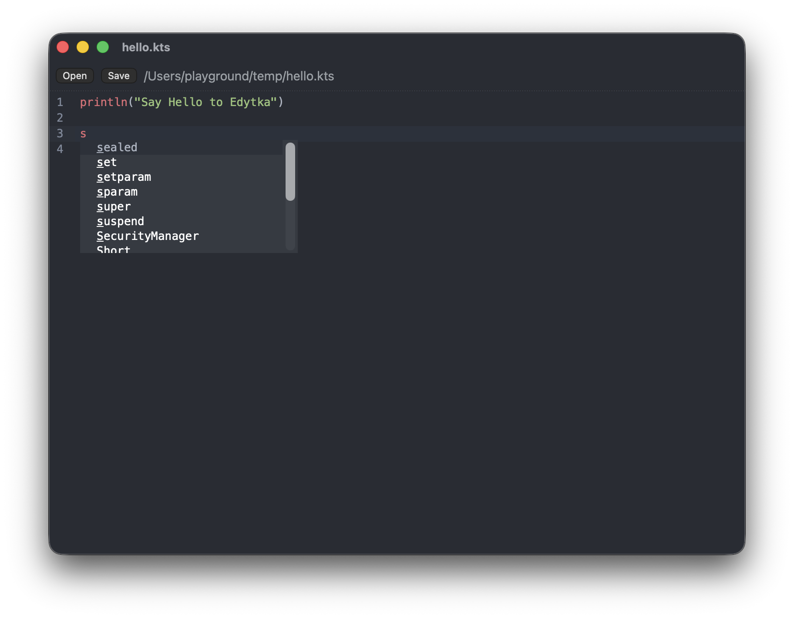

# Edytka

A minimal code and Markdown editor, built with Tauri.



## Prerequisites

- [Node.js](https://nodejs.org/) and npm
- [Rust](https://www.rust-lang.org/tools/install) (via rustup)
- Tauri's platform dependencies — see [Tauri prerequisites](https://tauri.app/start/prerequisites/)

## Run

```sh
npm install
npm run tauri dev
```

This starts the Vite dev server on http://localhost:1420 and opens the app window with hot reload.

## Build

```sh
npm run tauri build
```

The bundles are written to `host/target/release/bundle/` (e.g. `macos/Edytka.app`). To build only the macOS app bundle:

```sh
npm run tauri build -- --bundles app
```

## Releases

Versions are cut automatically from [Conventional Commits](https://www.conventionalcommits.org/):

- `fix:` → patch bump
- `feat:` → minor bump
- `feat!:` / `fix!:` / `BREAKING CHANGE:` → major bump

When you push to `main`, [release-please](https://github.com/googleapis/release-please) opens (or updates) a Release PR with the version bump and changelog. Merging that PR tags `vX.Y.Z`, creates the GitHub release, and triggers the macOS build that uploads the `.dmg` and `.app.tar.gz` to the release.

For fully hands-off releases:

1. In Settings → Actions → General → Workflow permissions, enable **Allow GitHub Actions to create and approve pull requests**.
2. In Settings → General → Pull Requests, enable **Allow auto-merge**.
3. Set a repository secret named `RELEASE_PLEASE_TOKEN` with a classic [Personal Access Token](https://docs.github.com/en/authentication/keeping-your-account-and-data-secure/creating-a-personal-access-token) that has `repo` scope.

Without the PAT, merge the Release PR by hand; the release and build still happen automatically.

The app is ad-hoc signed, not notarized. On first launch, macOS blocks it: open System Settings → Privacy & Security and click **Open Anyway** next to Edytka.
