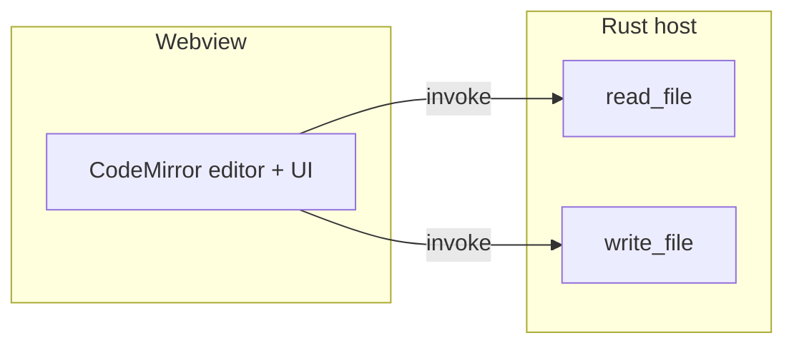
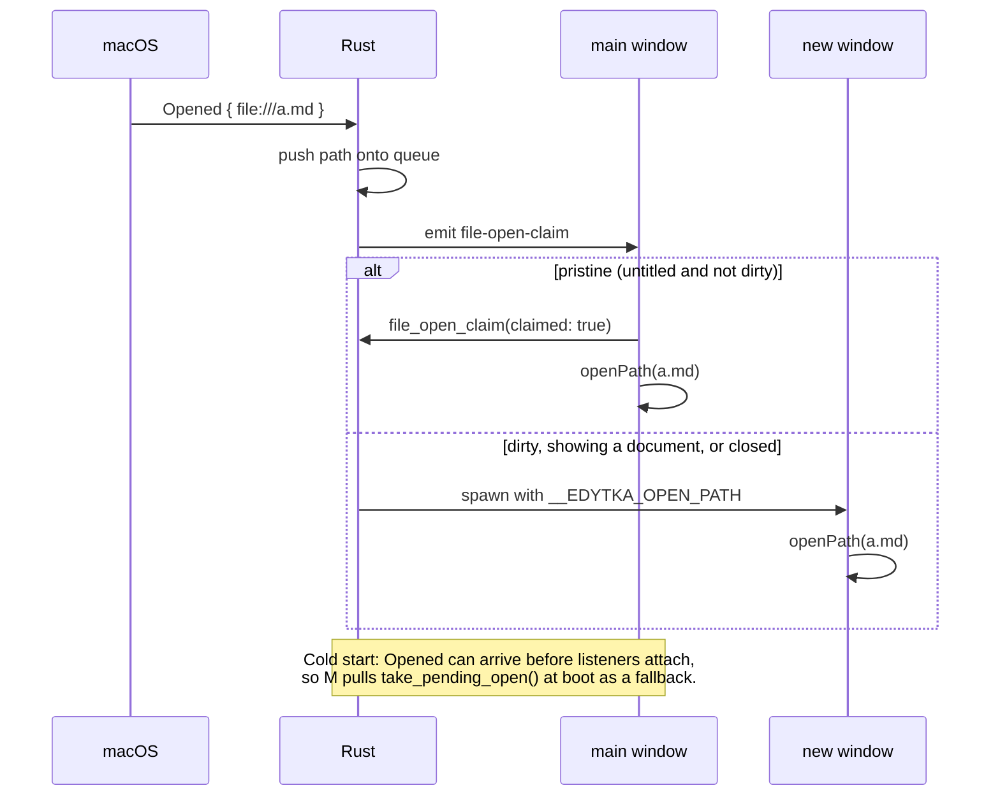
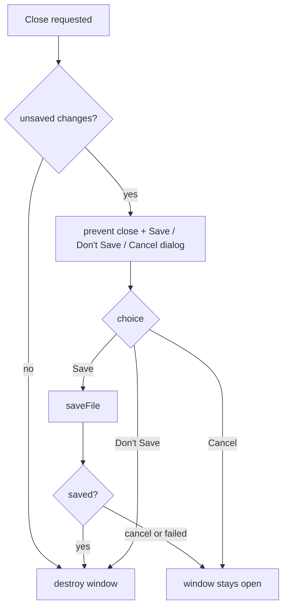

# Design

## Context

Edytka is a single-window Tauri 2 app on macOS. `view/main.ts` holds the whole frontend: a CodeMirror editor, open/save buttons, a dirty indicator driven by comparing the current document against the last-saved `Text`, and language/theme compartments. `host/src/lib.rs` exposes exactly two commands, `read_file` and `write_file`. The window is declared statically in `tauri.conf.json` (`app.windows[0]`), the capability set is `core:default` + `opener:default` + `dialog:default` + `core:window:allow-set-title`, and the dialog plugin is already installed. There is no error handling anywhere: both commands surface failures as rejected promises that the frontend currently ignores.

Verified against the installed crates (tauri 2.12.1, tauri-runtime-wry 2.12.1) and the Tauri v2 config schema:

- `bundle.fileAssociations` is the config key that generates `CFBundleDocumentTypes` in macOS `Info.plist` (fields: `ext`, `role`, `mimeType`, `rank`).
- `RunEvent::Opened { urls }` exists and is compiled in only on macOS/iOS/Android. On macOS it fires for open-file requests whether the app was running or not; the file path does **not** arrive in argv (that's Apple-Event territory), so parsing `std::env::args()` is unreliable here.
- `ExitRequested` fires with `code: Some` on Cmd+Q and with `code: None` when the last window is destroyed; quitting drops windows directly without per-window `CloseRequested` events.
- A window's `CloseRequested` can be prevented from JS (`onCloseRequested` + `preventDefault`), and `destroy()` bypasses the close-request path, so a confirmed close cannot loop.
- `core:window:default` does **not** include `allow-destroy`; the JS call to `destroy()` needs `core:window:allow-destroy` added to the capability.

## Goals / Non-Goals

**Goals:**

- Make the macOS system offer Edytka for the declared file types.
- Deliver every OS-initiated file open to a window showing the file's contents, reusing the pristine untitled window when one exists.
- Guarantee no silent loss of unsaved work when a window is closed.

**Non-Goals:**

- Windows/Linux file-open plumbing (argv, single-instance forwarding, registry/.desktop handling).
- App-quit (Cmd+Q) protection — recorded as a known gap; quit still drops all windows without prompting.
- Stay-alive-after-last-window and dock-reopen behavior, tabs, a "New" command, a cap on open windows, and markdown-specific features.

## Decisions

### 1. File associations via `bundle.fileAssociations` (one block per type group)

One association entry per family with a meaningful `CFBundleTypeName`: Markdown (`md`, `markdown`), Rust (`rs`), Kotlin (`kt`, `kts`), Java (`java`), C# (`cs`), Text (`txt`, `mimeType: text/plain`). `role: Editor` everywhere, `rank` left at default.

- *Alternative considered:* one catch-all entry named "Document". Rejected: per-type names show friendlier entries in "Open With" and Get Info.
- Note: associations only exist in the **bundled** app; `tauri dev` never has them. macOS caches Launch Services, so re-testing requires a fresh bundle at a stable path.

### 2. Delivery via `RunEvent::Opened`, not argv

The `.run()` callback matches `RunEvent::Opened { urls }`, converts each `Url` with `to_file_path()` (skipping non-`file:` URLs), and pushes the paths onto a Rust-side pending queue behind a mutex. The frontend never parses process arguments.

### 3. Claim protocol + pending queue (race-proof window assignment)

The static `main` window from `tauri.conf.json` stays: it is the only window that can be untitled (there is no New command yet). Assignment:

- On `Opened`, Rust emits `file-open-claim` to the `main` label. The main window's frontend replies via `invoke("file_open_claim", { claimed })` — `claimed: true` only if it is untitled **and** not dirty — and opens the file when it claims it. Rust treats emit failure, timeout (1s), or `claimed: false` as refusal and spawns a new window for that path.
- Every other path in the request — and every subsequent request while `main` is no longer pristine — spawns one window per path.
- Belt-and-braces for the cold-start race (the `Opened` event can arrive before the webview's listeners are attached): at boot the main window calls `take_pending_open()`, which pops the next unclaimed path. Claiming, spawning, and taking all drain the same queue, so a path is never opened twice and never lost.
- Spawned windows: `WebviewWindowBuilder` with unique labels (`window-1`, ...), same size as the configured window, and an `initialization_script` that sets `window.__EDYTKA_OPEN_PATH` to the JSON-escaped path. The frontend checks that variable on startup and loads the path directly — no event timing involved.

*Alternative considered:* always spawn a new window and never reuse. Rejected: cold-start double-click would produce two windows (empty + file).

### 4. Frontend: `openPath` as the single load entry point

`openFile()` is refactored into `openPath(path)` (invoke `read_file`, replace doc, update `savedDoc`, `setPath`) plus the dialog wrapper. The bootstrap order becomes: attach claim listener and `take_pending_open` first, then check `__EDYTKA_OPEN_PATH`. `setPath` gains title handling: each window's title becomes the filename or `untitled` (replacing the current `Edytka <version>` title, which only makes sense for one window).

### 5. Close-protection entirely in the frontend

`getCurrentWindow().onCloseRequested` calls `event.preventDefault()` when the document is dirty, then shows one native dialog (`message` with `buttons: { yes: "Save", no: "Don't Save", cancel: "Cancel" }`, `kind: "warning"`). Save runs the existing `saveFile` flow (which already handles untitled via the save dialog) and then `destroy()`; a cancelled save dialog aborts the close. Don't Save destroys. Cancel does nothing. Clean windows destroy immediately.

- *Alternative considered:* intercepting `CloseRequested` in Rust and round-tripping to the frontend. Rejected: dirty state lives in the frontend; the JS hook keeps the whole flow in one place.
- Because Cmd+Q never fires per-window `CloseRequested` (verified in the runtime source), this layer and any future app-quit protection cannot conflict.

### 6. Error reporting via the dialog plugin

Read failures (from any open path) and write failures (from any save path) show a native `message` error dialog; the window and its buffer stay intact. This is the first error handling in the app and reuses the installed plugin.

## Risks / Trade-offs

- [Cold-start race: `Opened` may arrive before the main webview can answer a claim] → the boot-time `take_pending_open` pull covers it; the claim timeout fallback covers a slow or dead webview.
- [20-file open produces 20 windows] → accepted for v1 (TextEdit-style); a cap is a later, additive policy.
- [Dialogs can stack if several dirty windows close in quick succession] → each window prompts independently; accepted, matches native macOS document behavior.
- [Launch Services caching hides association changes during testing] → tasks include rebuilding the bundle and re-registering if needed (`lsregister -f`); verification is against the bundle, never `tauri dev`.
- [Dropping the version from window titles] → minor; version remains visible in the bundle and the About/Get Info, and can be restored later.

## Migration Plan

None — this is a desktop app with no persisted state to migrate. Users receive the updated bundle through the existing release flow; associations take effect once Launch Services registers the new bundle.
