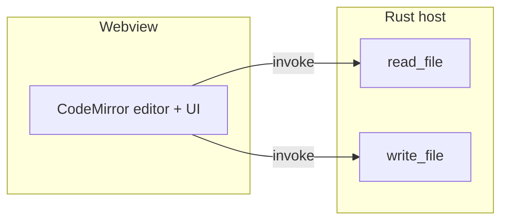
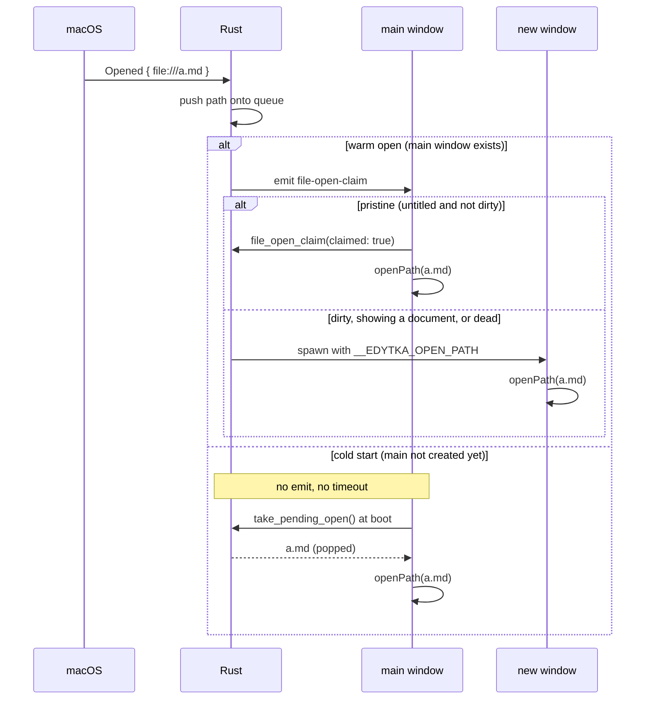
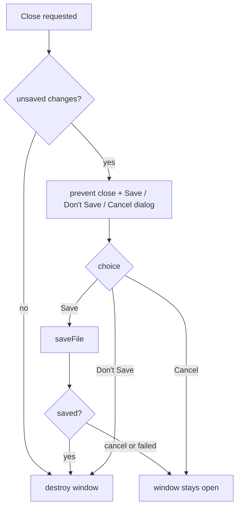
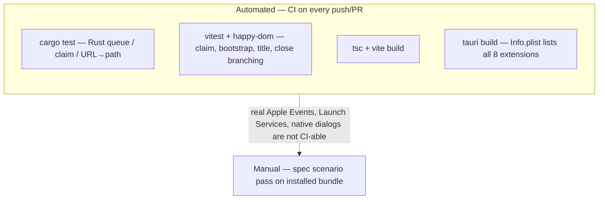

# Design

## Context

Edytka is a single-window Tauri 2 app on macOS. `view/main.ts` holds the whole frontend: a CodeMirror editor, open/save buttons, a dirty indicator driven by comparing the current document against the last-saved `Text`, and language/theme compartments. `host/src/lib.rs` exposes exactly two commands, `read_file` and `write_file`. The window is declared statically in `tauri.conf.json` (`app.windows[0]`), the capability set is `core:default` + `opener:default` + `dialog:default` + `core:window:allow-set-title`, and the dialog plugin is already installed. There is no error handling anywhere: both commands surface failures as rejected promises that the frontend currently ignores.

Verified against the installed crates (tauri 2.12.1, tauri-runtime-wry 2.12.1) and the Tauri v2 config schema:

- `bundle.fileAssociations` is the config key that generates `CFBundleDocumentTypes` in macOS `Info.plist` (fields: `ext`, `role`, `mimeType`, `rank`).
- `RunEvent::Opened { urls }` exists and is compiled in only on macOS/iOS/Android. On macOS it fires for open-file requests whether the app was running or not; the file path does **not** arrive in argv (that's Apple-Event territory), so parsing `std::env::args()` is unreliable here.
- Cmd+Q does not go through `ExitRequested` at all: it surfaces as `RunEvent::Exit` via tao's `LoopDestroyed` and is not preventable at the Tauri layer. `ExitRequested { code: Some }` fires only for programmatic `AppHandle::exit(code)`; `ExitRequested { code: None }` fires when the last window is destroyed. Either way, quitting drops windows directly without per-window `CloseRequested` events.
- A window's `CloseRequested` can be prevented from JS (`onCloseRequested` + `preventDefault`), and `destroy()` bypasses the close-request path, so a confirmed close cannot loop.
- `core:window:default` does **not** include `allow-destroy`; the JS call to `destroy()` needs `core:window:allow-destroy` added to the capability.

## Goals / Non-Goals

**Goals:**

- Make the macOS system offer Edytka for the declared file types.
- Deliver every OS-initiated file open to a window showing the file's contents, reusing the pristine untitled window when one exists.
- Guarantee no silent loss of unsaved work when a window is closed.

**Non-Goals:**

- Windows/Linux file-open plumbing (argv, single-instance forwarding, registry/.desktop handling).
- App-quit (Cmd+Q) protection — recorded as a known gap; quit still drops all windows without prompting.
- Stay-alive-after-last-window and dock-reopen behavior, tabs, a "New" command, a cap on open windows, and markdown-specific features.

## Decisions

### 1. File associations via `bundle.fileAssociations` (one block per type group)

One association entry per family with a meaningful `CFBundleTypeName`: Markdown (`md`, `markdown`), Rust (`rs`), Kotlin (`kt`, `kts`), Java (`java`), C# (`cs`), Text (`txt`, `mimeType: text/plain`). `role: Editor` everywhere, `rank` left at default.

- *Alternative considered:* one catch-all entry named "Document". Rejected: per-type names show friendlier entries in "Open With" and Get Info.
- Note: associations only exist in the **bundled** app; `tauri dev` never has them. macOS caches Launch Services, so re-testing requires a fresh bundle at a stable path.

### 2. Delivery via `RunEvent::Opened`, not argv

The `.run()` callback matches `RunEvent::Opened { urls }`, converts each `Url` with `to_file_path()` (skipping non-`file:` URLs), and pushes the paths onto a Rust-side pending queue behind a mutex. The frontend never parses process arguments.

- *Alternative considered:* parsing `std::env::args()`. Rejected: on macOS the file arrives via Apple Event, not argv, so the args are empty or unrelated.

### 3. Claim protocol + pending queue (race-proof window assignment)

The static `main` window from `tauri.conf.json` stays: it is the only window that can be untitled (there is no New command yet). Assignment:

- Cold start (`Opened` arrives during launch, before `Ready`, so the `main` window does not exist yet): Rust only pushes the paths onto the queue — no claim emit and no timeout. The boot-time pull is the sole cold-start path; this closes the race where a claim timeout would spawn `window-1` before the main webview can answer, leaving an untitled `main` plus a spawned window.
- Warm open (the `main` window exists): Rust emits `file-open-claim` to the `main` label. The main window's frontend replies via `invoke("file_open_claim", { claimed })` — `claimed: true` only if it is untitled **and** not dirty — and opens the file when it claims it. Rust treats timeout (1s), a dead window, or `claimed: false` as refusal and spawns a new window for that path.
- Every other path in the request — and every subsequent request while `main` is no longer pristine — spawns one window per path.
- At boot the main window calls `take_pending_open()`, which pops the next unclaimed path. Claiming, spawning, and taking all drain the same queue, so a path is never opened twice and never lost. To guard against two `Opened` requests landing in the same tick both being claimed while the first `openPath` is still in flight, the frontend sets an in-flight claim flag synchronously before replying `claimed`.
- Spawned windows: `WebviewWindowBuilder` with unique labels (`window-1`, ...), same size as the configured window, and an `initialization_script` that sets `window.__EDYTKA_OPEN_PATH` to the JSON-escaped path. The frontend checks that variable on startup and loads the path directly — no event timing involved.
- Capability coverage: plugin commands are ACL-checked per calling window label, so the capability's `windows` list must cover spawned labels too (`["main", "window-*"]`) — otherwise every spawned window loses `destroy`, dialogs, and `set-title`, which would break close-protection outside `main`.

*Alternative considered:* always spawn a new window and never reuse. Rejected: cold-start double-click would produce two windows (empty + file).

### 4. Frontend: `openPath` as the single load entry point

`openFile()` is refactored into `openPath(path)` (invoke `read_file`, replace doc, update `savedDoc`, `setPath`) plus the dialog wrapper. The bootstrap order becomes: attach claim listener and `take_pending_open` first, then check `__EDYTKA_OPEN_PATH`. `setPath` gains title handling: each window's title becomes the filename or `untitled` (replacing the current `Edytka <version>` title, which only makes sense for one window).

- *Alternative considered:* delivering spawned-window paths as a Tauri event instead of the init-script variable. Rejected: the script runs before any listener can attach, so the variable is the only race-free delivery for spawned windows; the claim event remains for the already-running `main` window.

### 5. Close-protection entirely in the frontend

`getCurrentWindow().onCloseRequested` calls `event.preventDefault()` when the document is dirty, then shows one native dialog (`message` with `buttons: { yes: "Save", no: "Don't Save", cancel: "Cancel" }`, `kind: "warning"`). Save runs the existing `saveFile` flow (which already handles untitled via the save dialog) and then `destroy()`; a cancelled save dialog aborts the close. Don't Save destroys. Cancel does nothing. Clean windows destroy immediately.

- *Alternative considered:* intercepting `CloseRequested` in Rust and round-tripping to the frontend. Rejected: dirty state lives in the frontend; the JS hook keeps the whole flow in one place.
- Because Cmd+Q delivers no per-window `CloseRequested` and cannot be intercepted at the Tauri layer at all (it surfaces only as `RunEvent::Exit`, see Context), this frontend layer and any future app-quit protection cannot conflict.

### 6. Error reporting via the dialog plugin

Read failures (from any open path) and write failures (from any save path) show a native `message` error dialog; the window and its buffer stay intact. This is the first error handling in the app and reuses the installed plugin.

- *Alternative considered:* in-page banners/toasts. Rejected: more UI surface in an editor chrome that intentionally stays minimal; the native dialog is already installed and consistent with the close prompt.

### 7. Pure core extracted for unit-testability

Rust: the queue/claim mechanics (`push`, `claim`, `take`, `pop_for_spawn`) and the URL→path conversion become small pure functions, unit-tested with `#[cfg(test)]` — `cargo test` needs no GUI.

Frontend: the decision logic moves into a new `view/state.ts` with no Tauri or DOM imports: `shouldClaim(path, dirty)` (untitled and not dirty), the bootstrap precedence rule (claim event, then `take_pending_open`, then `__EDYTKA_OPEN_PATH`), `documentTitle(path)` (basename or `untitled`), and the close-decision branching (`dirty ? dialog : destroy`). `main.ts` keeps only the imperative wiring: invokes, dialogs, CodeMirror, event handlers.

- *Alternative considered:* testing through the real Tauri APIs. Rejected: that needs a live webview and is not CI-able; unit tests with mocked APIs are the only automated layer available.

## Verification Plan

Three layers: automated unit tests (Rust + Vitest), CI gates (typecheck/build and a bundle assertion), and one manual pass on a real macOS GUI for everything the first two cannot observe. Traceability from the spec scenarios:

| Spec scenario | Automated test | Manual pass |
| --- | --- | --- |
| Open With lists Edytka (.md / .txt) | `tauri build` + `plutil` assertion on `CFBundleDocumentTypes` | confirm in Finder |
| Cold-start single-file open, exactly one window | cargo: queue take/claim; vitest: bootstrap precedence | double-click on installed bundle |
| Warm open while running | cargo: claim refusal → spawn; vitest: claim reply | open file with app running |
| Forced open via Open With | same plumbing as cold start | Open With → Edytka |
| Multiple files at once | cargo: FIFO ordering, one spawn per path | multi-select open |
| Dirty untitled window preserved | vitest: `shouldClaim(path, dirty=true)` is false | open file with dirty window |
| Document windows never reused | vitest: `shouldClaim(path, …)` false when a document is loaded | same, with saved file open |
| Window titles (filename / untitled) | vitest: `documentTitle` | inspect title bars |
| Failed open reported, app usable | vitest: read-failure branch shows error dialog, buffer intact | open a permission-denied file |
| Close prompts Save / Don't Save / Cancel | vitest: close branching with dialog mock (each button) | close dirty window, exercise all three |
| Clean window closes silently | vitest: clean → `destroy()` with no dialog | close unmodified window |
| Save-dialog cancel keeps window open | vitest: cancelled save dialog → no destroy | cancel the save dialog on close |
| Save-dialog completed closes window | vitest: completed save dialog → save → destroy | complete the save dialog on close |
| Failed save keeps window open, informs user | vitest: write-failure branch → no destroy + error dialog | close with a read-only target |

Regression strategy:

- Every spec scenario has at least one automated test where feasible; the table above is the traceability source and is kept current with the specs.
- CI runs the automated layers on every push/PR, so regressions in claim/queue/plist/decision logic fail the merge rather than shipping.
- The manual pass is the regression net for what CI cannot reach (real Apple Events, Launch Services caching, native dialogs) and is re-run before every release.

## Risks / Trade-offs

- [Cold-start race: `Opened` arrives before `Ready`, when `main` does not exist yet] → pre-Ready opens never emit or time out; the boot-time `take_pending_open` pull is the sole cold-start path. The claim timeout runs only on warm opens and covers a dead webview.
- [20-file open produces 20 windows] → accepted for v1 (TextEdit-style); a cap is a later, additive policy.
- [Dialogs can stack if several dirty windows close in quick succession] → each window prompts independently; accepted, matches native macOS document behavior.
- [Launch Services caching hides association changes during testing] → tasks include rebuilding the bundle and re-registering if needed (`lsregister -f`); verification is against the bundle, never `tauri dev`.
- [Dropping the version from window titles] → minor; version remains visible in the bundle and the About/Get Info, and can be restored later.
- [Vitest mocks drift from the real Tauri API surface] → mocks are typed against the installed `@tauri-apps/api`/plugin packages; the manual pass is the backstop for real behavior.
- [happy-dom approximates the webview] → `state.ts` is DOM-free by construction (pure functions); all DOM wiring stays in `main.ts`, outside unit scope.

## Migration Plan

None — this is a desktop app with no persisted state to migrate. Users receive the updated bundle through the existing release flow; associations take effect once Launch Services registers the new bundle.
