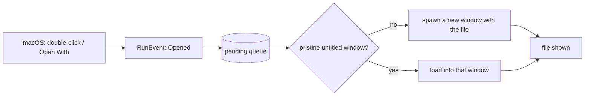

# Proposal

## Why

Edytka cannot be opened by double-clicking a file: macOS never lists it as an application for the formats it edits (the bundle declares no file associations), and even when the system is forced to use it, the app ignores the open-file event and starts with an empty untitled buffer. A text editor that can't be reached from the Finder is effectively invisible. This change makes the system able to hand files to Edytka and makes Edytka able to open them — and adds close-protection so the resulting multi-window model never silently discards unsaved work.

## What Changes

- Declare macOS file associations for `md`, `markdown`, `rs`, `kt`, `kts`, `java`, `cs`, and `txt` (role Editor) in `bundle.fileAssociations`.
- Handle the macOS open-file event (`RunEvent::Opened`) in Rust: convert file URLs to paths and deliver them to the frontend.
- Open each incoming file in a window. The first file is offered to the pristine untitled startup window (claim protocol); when that window is dirty, closed, or already showing a document — or for additional files — a new window is spawned that loads the file.
- Refactor the frontend open flow so a path can be loaded directly (not only via the Open dialog); bootstrap spawned windows from an initialization script.
- Show the document's filename (or "untitled") in each window's title bar.
- Close-protection: closing a window with unsaved changes prompts Save / Don't Save / Cancel instead of silently discarding the buffer.
- Add `core:window:allow-destroy` to the window capability so the frontend can destroy a window after a confirmed close.

No breaking changes. macOS only (Windows/Linux file-open paths are out of scope).

## Capabilities

### New Capabilities

- `file-open`: The operating system can hand Edytka file paths (declared associations and open events), and Edytka opens each file in a window, reusing a pristine untitled window when one is available.
- `close-protection`: Closing a window with unsaved changes prompts to save, discard, or cancel; unsaved work is never lost silently.

### Modified Capabilities

None — the project has no existing specs.

## Impact

- `host/tauri.conf.json` — new `bundle.fileAssociations` block.
- `host/src/lib.rs` — `RunEvent::Opened` handling, window spawning (`WebviewWindowBuilder` + `initialization_script`), claim protocol, quit/close bookkeeping as needed.
- `view/main.ts` — `openPath` refactor, `__OPEN_PATH` bootstrap, claim reply, `onCloseRequested` flow, per-window titles.
- `host/capabilities/default.json` — one added permission (`core:window:allow-destroy`).
- No new dependencies: the dialog plugin used for the Save prompt is already installed.
- Known gaps (recorded, not built): Cmd+Q quits without prompting (app-quit protection deferred); no stay-alive-after-last-window / dock-reopen behavior; no cap on simultaneous windows.
