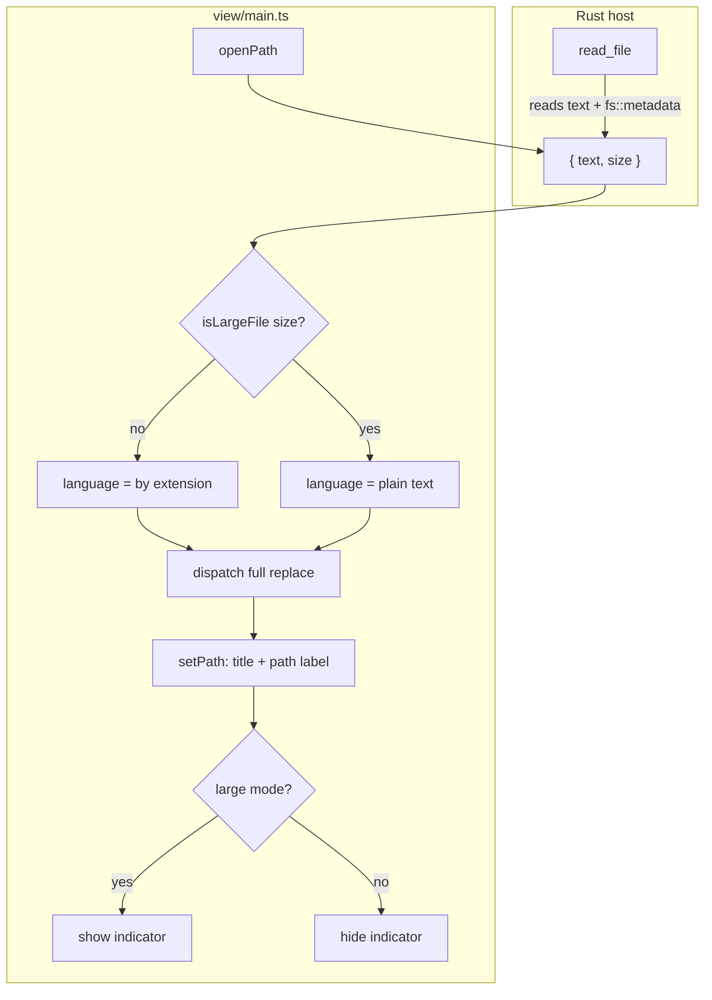

# Design



```mermaid
sequenceDiagram
    participant F as frontend
    participant R as read_file (Rust)
    participant CM as CodeMirror
    F->>R: invoke("read_file", { path })
    R-->>F: { text, size }
    F->>F: mode = size > 20 MiB
    F->>CM: dispatch(full replace) + reconfigure language
    F->>F: setPath keeps mode; indicator per mode
```

## Context

- `read_file` (`host/src/lib.rs`) returns a bare `String`; the frontend never learns the file's size.
- `view/main.ts` holds the `language` Compartment; `setPath` reconfigures it by extension on every open and save.
- `view/state.ts` is the pure, unit-tested decision-logic module (no Tauri/DOM imports).
- `index.html` header already hosts a hidden `#dirty` indicator span — the pattern to mirror.
- Motivation lives in `proposal.md`; the behavior contract in `specs/large-file-handling/spec.md`.

## Goals / Non-Goals

**Goals:**

- One boolean of mode state per window, decided once per open.
- Byte-exact threshold from the OS, not from a JS string estimate.
- Decision logic stays pure and unit-testable in `view/state.ts`.
- Smallest diff that removes the parser from large files.

**Non-Goals:**

- No manual "highlight anyway" toggle, no hard size cap, no eager pre-parsing.
- No trimming of `basicSetup` (fold gutter, bracket matching, etc. stay as-is).
- No handling of files that change size between open and save.

## Decisions

### 1. Threshold lives as a pure function in `view/state.ts`

`LARGE_FILE_BYTES = 20 * 1024 * 1024` and `isLargeFile(size: number): boolean` with `size > LARGE_FILE_BYTES` (strictly greater, per the spec boundary).

- **Alternative:** inline the check in `main.ts`. Rejected: `state.ts` exists precisely so decisions like this are unit-testable without a webview.

### 2. Size comes from Rust `fs::metadata`

`read_file` returns `{ text, size }`, with `size` from `std::fs::metadata` before reading.

- **Alternative A:** `text.length` (UTF-16 code units). Rejected: undercounts multibyte text (CJK ≈ ⅓ of byte size), so a 30 MiB CJK file would skip the fallback.
- **Alternative B:** `TextEncoder().encode(text).length` in JS. Correct, but an extra O(n) pass over the whole string; metadata is already paid for by the OS and matches the user's mental model of "file size".
- The command is internal (single call site in `openPath`), so changing its shape is not a breaking change to any external contract.

### 3. Degradation is language-only

Reconfigure the `language` Compartment to plain text (empty language), leaving `basicSetup` untouched. No parser runs, so scrolling and typing stay responsive. Folding and autocompletion find nothing to do and cost nothing measurable.

- **Alternative:** also strip fold gutter / bracket matching / selection-match highlighting. Rejected for this change: more churn through `basicSetup` for negligible extra benefit once the parser is gone.

### 4. Mode state is computed in `openPath`, respected by `setPath`

`openPath` computes `largeMode = isLargeFile(size)` before dispatching, stores it, and `setPath` consults it instead of always reconfiguring by extension — otherwise a title update or save would silently restore highlighting (the spec forbids that).

- **Alternative:** recompute from `text.length` in `setPath`. Rejected: `setPath` has no text or size, and keeping the decision at the single point where the data arrives avoids divergence.

### 5. Indicator mirrors the `#dirty` pattern

A hidden-by-default span in the header (`large file · highlighting off`), toggled by the same mode boolean. No dialog — a one-time notice would fire on every large-file open and be noise.

## Risks / Trade-offs

- [Strictly-greater boundary is easy to get wrong] → the exact boundary (20 MiB triggers nothing, 20 MiB + 1 B triggers) is pinned in the spec scenario and in a unit test.
- [IPC shape change silently breaks the frontend] → single call site; the TypeScript `invoke<...>` type is updated in the same commit.
- [User confusion — why did colors disappear?] → the header indicator explains the mode.
- [File changes size between metadata and read] → the mode decision uses the read-time size; worst case is a misjudged mode for one open, not a correctness issue.
- [Very large files still cost memory (full text + document tree)] → out of scope; a hard size cap would be a future capability.
