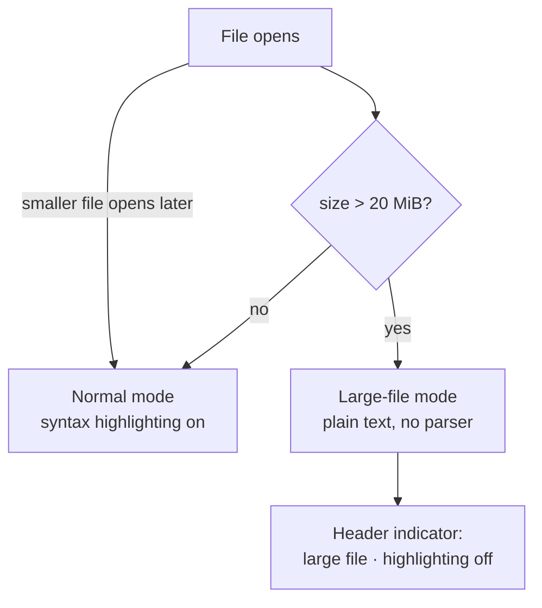

# Proposal

## Why

Scrolling large documents (observed on `.md` files) lags noticeably: CodeMirror 6 parses on a time budget, only slightly ahead of the viewport, so fast scrolling into unparsed territory renders plain text and "catches up" with a visible delay. Files above 20 MiB get a degraded, parser-free mode instead.

## What Changes

- `read_file` returns the file's byte size (`std::fs::metadata`) alongside its text: `{ text, size }`.
- Files strictly larger than `20 * 1024 * 1024` bytes open in **large-file mode**: the language compartment is configured to plain text, so no parser runs, no highlighting appears, and scrolling/editing stay responsive.
- A small header indicator shows `large file · highlighting off` only in this mode.
- Opening a normal-sized file afterwards restores regular syntax highlighting; the mode is decided once per open, per window.
- The threshold decision lives as a pure, unit-tested function (`isLargeFile`) in `view/state.ts`.

Out of scope: a manual "highlight anyway" toggle, a hard maximum file size, and eager pre-parsing of sub-threshold files.

## Capabilities

### New Capabilities

- `large-file-handling`: the behavior Edytka applies when opening a file above the size threshold — plain-text editing without syntax highlighting, an explanatory indicator, and restoration of normal mode for smaller files.

### Modified Capabilities

(none — `file-open` covers the OS handoff and window reuse; its requirements are unchanged.)

## Impact

- `host/src/lib.rs`: `read_file` command signature and return shape.
- `view/main.ts`: open path, mode state, `setPath` interplay, header indicator.
- `view/state.ts` + `view/state.test.ts`: threshold decision function and tests.
- `index.html`: indicator element.
- No dependency changes.
